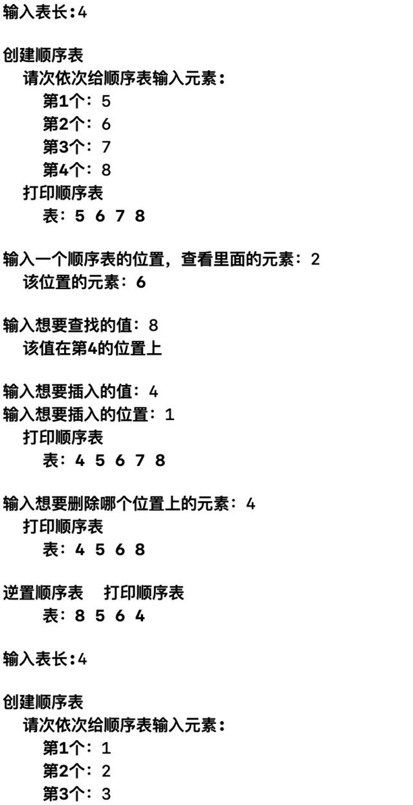
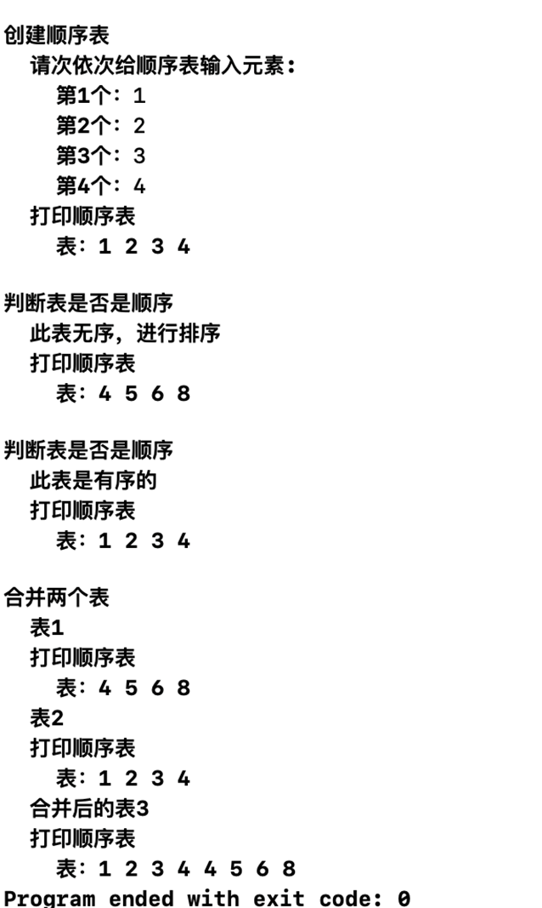

# 数据结构 - 实验报告1 —— 顺序表

## 实验题目：*顺序表**的基本操作***

#### 实验目的：

1. 掌握顺序表的定义；

2. 掌握顺序表的基本操作，如初始化、创建、插入和删除等。

   

#### 实验内容：

定义一个存储整数类型数据元素的顺序表，完成顺序表上的如下功能：

1. 初始化顺序表；

2. 从键盘输入n个整数，创建存储这些元素的顺序表；

3. 打印顺序表；

4. 根据指定的位置读取相应的数据元素值；

5. 给定一个元素，插入到表中指定的位置之前；

6. 删除指定位置的元素；

7. （选做）将顺序表中的元素逆置。

8. （选做）将两个有序的顺序表合并成一个有序的顺序表。


#### 实验提示：

1.  顺序表的定义：

```C++
typedef struct {

int \*elem; //指向数据元素的基地址

int length; //线性表的当前长度

}SqList；
```

2.  定义完成相应功能的函数，如

```C++
Status InitList(SqList &L)

{

L.elem=new int\[MAXSIZE\];

if(L.elem==NULL) return OVERFLOW;

L.length=0;

return OK;

}

Status CreatList(SqList &L, int length)

{

if(length\>MAXSIZE) return ERROR;

cout\<\<“请依次输入元素:”\<\<endl;

for(int i=0;i\<length;i++) cin\>\>L.elem\[i\];

L.length=length;

return OK;

}

```

3.  在主函数中调用，如

```C++
int main()

{

SqList L; //定义顺序表L

InitList(L); //初始化顺序表L

int length;

cout\<\<“请输入顺序表的长度：”\<\<endl;

cin\>\>length;

CreatList(L,length);//从键盘输入元素，创建顺序表L

PrintList(L);//打印顺序表L

... ...

return 0;

}
```

#### 实验要求：

1. 程序要添加适当的注释，程序的书写要采用缩进格式。

2. 程序要具在一定的健壮性，即当输入数据非法时，程序也能适当地做出反应，如插入删除时指定的位置不对等等。

3. 程序要做到界面友好，在程序运行时用户可以根据相应的提示信息进行操作。

4. 书写实验报告,具体要求见下。

>  上传实验报告（pdf格式）到课程群的相应文件夹。文档的命名方式为：学号姓名_实验报告1.pdf。
>  注意：不能直接复制本文档中或者ppt中的代码到编译器中！！！


### 实验报告写作规范

1.  内容描述：本次实验的内容是什么？需要解决的问题的是什么？

> 掌握顺序表的定义，掌握顺序表的基本操作，如初始化、创建、插入和删除等。

2. 概要设计：用到哪些数据结构，程序由几个函数构成，每个函数的功能，函数间调用关系等。

3. 详细设计：程序中定义的具体数据类型，各个模块的算法及伪代码等。

（2, 3可以合在一起）

```C++
SqList L1;

      **typedef** **struct** {

        **int**\* elem;

        **int** length;

}SqList;

InitList(L1);

Status InitList(SqList& L) {

        L.elem = **new** **int**\[Maxsize\];

        **if** (!L.elem){

          cout \<\< "空间分配失败";

          **return** Overflow;

        }

        L.length = 0;

        **return** Ok;

}

LengList(L1);

      Status LengList(SqList& L){

        **if** (!L.elem) {

          cout \<\< "不能输入表长，因为空间分配失败";

          **return** Overflow;

        }

        cout \<\<endl\<\< "输入表长:";

        cin \>\> L.length;

        **while** (L.length \> Maxsize \|\| L.length \<= 0) {

          cout \<\< "你的表长不符合,得\<="\<\<Maxsize\<\<" \|\| \> 0"\<\<endl\<\<"请重新输入：";

          cin \>\> L.length;

        }

        **return** Ok;

}

CreatList(L1);

Status CreatList(SqList& L) {

        cout \<\< endl \<\< "创建顺序表" \<\< endl;

        **if** (!L.elem) {

          cout \<\< "  不能创建，因为表不存在";

          **return** Overflow;

        }

        cout \<\< "  请次依次给顺序表输入元素:" \<\< endl;

        **for** (**int** i = 0; i \< L.length; i++){

          cout \<\< "    第" \<\< i + 1 \<\< "个：";

          cin \>\> L.elem\[i\];

        }

        **return** Ok;

}

PrintList(L1);

      Status PrintList(SqList L) {

        cout \<\< "  打印顺序表" \<\< endl;

        **if** (!L.elem) {

          cout \<\< "    表不存在";

          **return** Overflow;

        }

        cout\<\< "    表：";

        **for** (**int** i = 0; i \< L.length; i++)

           cout \<\< L.elem\[i\] \<\< " ";

        cout \<\< endl;

        **return** Ok;

}

GetElem(L1);

Status GetElem(SqList L) {

        **if** (!L.elem) {

          cout \<\< "不能取值因为表不存在";

          **return** Overflow;

        }

        **int** e;

        cout \<\<endl\<\< "输入一个顺序表的位置，查看里面的元素：";

        cin \>\> e;

        **while** (e \> L.length \|\| e \< 1) {

          cout \<\< "你想查找的位置不符合表长,请重新输入：";

          cin \>\> e;

        }

        cout \<\< "  该位置的元素：" \<\< L.elem\[e - 1\] \<\< endl;

        **return** Ok;

}

LocateElem(L1);

Status LocateElem(SqList L) {

        **int** e;

        cout \<\<endl\<\< "输入想要查找的值：";

        **if** (!L.elem) {

          cout \<\< "不能查找，因为表不存在";

          **return** Overflow;

        }

        cin \>\> e;

        **for** (**int** i = 0; i \< L.length; i++)

          **if** (L.elem\[i\] == e) {

            cout \<\< "  该值在第" \<\< i + 1 \<\< "的位置上" \<\< endl;

            **return** Ok;

          }

        cout \<\< "  该值不在表里"\<\<endl;

        **return** Error;

}

ListInsert(L1);

Status ListInsert(SqList &L) {

        **int** e,i;

        cout \<\<endl\<\< "输入想要插入的值：";

        **if** (!L.elem) {

          cout \<\< "不能插入，因为表不存在";

          **return** Overflow;

        }

        cin \>\> e;

        cout \<\< "输入想要插入的位置：";

        cin \>\> i;

        **while** (i \> L.length \|\| i \< 1) {

          cout \<\< "你想插入的位置不符合表长,请重新输入：";

          cin \>\> i;

       }

       **for** (**int** j = L.length - 1; j \>= i - 1; j--)

         L.elem\[j + 1\] = L.elem\[j\];

       L.elem\[i - 1\] = e;

       L.length++;

       PrintList(L);

       **return** Ok;

}

ListDelete(L1);

Status ListDelete(SqList& L) {

        **int** e;

        cout \<\<endl\<\< "输入想要删除哪个位置上的元素：";

        **if** (!L.elem) {

          cout \<\< "不能删除，因为表不存在";

          **return** Overflow;

       }

       cin \>\> e;

       **while** (e \> L.length \|\| e \< 1) {

         cout \<\< "你想删除的位置不符合表长,请重新输入：";

         cin \>\> e;

       }

       **for** (**int** i = e ; i \< L.length; i++)

         L.elem\[i - 1\] = L.elem\[i\];

       L.length--;

       PrintList(L);

       **return** Ok;

}

InverList(L1);

Status InverList(SqList& L) {

        **int** e,i,j;

        cout \<\<endl\<\< "逆置顺序表";

        **if** (!L.elem) {

          cout \<\< "不能逆置，因为表不存在";

          **return** Overflow;

        }

        **for** (i = 0,j = L.length - 1; i \<= L.length / 2; i++, j--) {

          e = L.elem\[i\];

          L.elem\[i\] = L.elem\[j\];

          L.elem\[j\] = e;

        }

        PrintList(L);

        **return** Ok;

}

OderList(L1);

Status OderList(SqList& L) {

        **int** e = 0, k;

        cout \<\< endl \<\< "判断表是否是顺序";

        **if** (!L.elem) {

          cout \<\< "不能判断，因为表不存在";

          **return** Overflow;

        }

        **for** (**int** i = 1; i \< L.length; i++) {

          **if** (L.elem\[i\] \<  L.elem\[i - 1\]) {

            e = 1;

            **break**;

          }

        }

        **if** (e == 0)

          cout \<\< endl \<\< "  此表是有序的" \<\< endl;

        **else** {

          cout \<\< endl \<\< "  此表无序，进行排序" \<\< endl;

          **for** (**int** i = 1; i \< L.length; i++) {

            **for** (**int** j = i; j \> 0; j--) {

              **if** (L.elem\[j\] \< L.elem\[j - 1\]) {

                k = L.elem\[j - 1\];

                L.elem\[j - 1\] = L.elem\[j\];

                L.elem\[j\] = k;

              }

              **else**

                **break**;

            }

          }

        }

        PrintList(L);

        **return** Ok;

}

MergeList(L1,L2,L3);

Status MergeList(SqList L1, SqList L2, SqList &L3) {

        **int** i = 0;

        **int** j = 0;

        **int** k = 0;

        cout \<\< endl \<\< "合并两个表";

        **if** (!L1.elem \|\| !L2.elem \|\| !L3.elem) {

          cout \<\< "不能，因为有表不存在";

          **return** Overflow;

        }

        **if** (L1.length + L2.length \> Maxsize) {

          **return** Overflow;

        }

        cout \<\< endl \<\< "  表1"\<\<endl;

        PrintList(L1);

        cout \<\< "  表2" \<\< endl;

        PrintList(L2);

        **while** (i \< L1.length && j \< L2.length) {

            L3.elem\[k++\] = L1.elem\[i++\];

          **else**

            L3.elem\[k++\] = L2.elem\[j++\];

        }

        **while**(i \< L1.length)

          L3.elem\[k++\] = L1.elem\[i++\];

        **while** (j \< L2.length)

          L3.elem\[k++\] = L2.elem\[j++\];

        L3.length = k;

        cout \<\< "  合并后的表3"\<\<endl;

        PrintList(L3);

        **return** Ok;

}
```

4.  调试分析：编码和调试过程中遇到的问题，如何解决的？个人的经验和体会，有何收获？等。

> 开始只是有些小问题，比如丢了分号或者括号，单词会拼错，前后不一致。

5. 用户使用说明：如何使用你编写的程序，屏幕截图。

6. 测试结果：给出测试结果，包括输入和输出。

（5, 6可以合在一起）





7.  源代码：直接粘贴源代码

```C++
#include <iostream>
using namespace std;
#define Maxsize 100    
#define Ok 1           
#define Overflow -2    
#define Error 0        
typedef int Status;    

typedef struct {
    int* elem;         
    int length;        
}SqList;

Status InitList(SqList& L) {
    L.elem = new int[Maxsize];     
    if (!L.elem){                  
        cout << "空间分配失败";
        return Overflow;
    }
    L.length = 0;                  
    return Ok;
}

Status LengList(SqList& L){
  if (!L.elem) {                                  
     cout << "不能输入表长，因为空间分配失败";
     return Overflow;
  }
  cout <<endl<< "输入表长:";
  cin >> L.length;
  while (L.length > Maxsize || L.length <= 0) {     
    cout << "你的表长不符合,得<="<<Maxsize<<" || > 0"<<endl<<"请重新输入：";
    cin >> L.length;
  }
  return Ok;
}

Status CreatList(SqList& L) {
    cout << endl << "创建顺序表" << endl;
    if (!L.elem) {
        cout << "  不能创建，因为表不存在";
        return Overflow;
    }
    cout << "  请次依次给顺序表输入元素:" << endl;
    for (int i = 0; i < L.length; i++){
        cout << "    第" << i + 1 << "个：";
        cin >> L.elem[i];
    }
    return Ok;
}

Status PrintList(SqList L) {
    cout << "  打印顺序表" << endl;
    if (!L.elem) {
        cout << "    表不存在";
        return Overflow;
    }
    cout<< "    表：";
    for (int i = 0; i < L.length; i++)
        cout << L.elem[i] << " ";
    cout << endl;
    return Ok;
}

Status GetElem(SqList L) {
    if (!L.elem) {
        cout << "不能取值因为表不存在";
        return Overflow;
    }
    int e;
    cout <<endl<< "输入一个顺序表的位置，查看里面的元素：";
    cin >> e;
    while (e > L.length || e < 1) {
        cout << "你想查找的位置不符合表长,请重新输入：";
        cin >> e;
    }
    cout << "  该位置的元素：" << L.elem[e - 1] << endl;
    return Ok;
}

Status LocateElem(SqList L) {
    int e;
    cout <<endl<< "输入想要查找的值：";
    if (!L.elem) {
        cout << "不能查找，因为表不存在";
        return Overflow;
    }
    cin >> e;
    for (int i = 0; i < L.length; i++)
        if (L.elem[i] == e) {
            cout << "  该值在第" << i + 1 << "的位置上" << endl;
            return Ok;
        }
    cout << "  该值不在表里"<<endl;
    return Error;
}

Status ListInsert(SqList &L) {
    int e,i;
    cout <<endl<< "输入想要插入的值：";
    if (!L.elem) {
        cout << "不能插入，因为表不存在";
        return Overflow;
    }
    cin >> e;
    cout << "输入想要插入的位置：";
    cin >> i;
    while (i > L.length || i < 1) {
        cout << "你想插入的位置不符合表长,请重新输入：";
        cin >> i;
    }
    for (int j = L.length - 1; j >= i - 1; j--)  
        L.elem[j + 1] = L.elem[j];
    L.elem[i - 1] = e;                           
    L.length++;                                  
    PrintList(L);
    return Ok;
}

Status ListDelete(SqList& L) {
    int e;
    cout <<endl<< "输入想要删除哪个位置上的元素：";
    if (!L.elem) {
        cout << "不能删除，因为表不存在";
        return Overflow;
    }
    cin >> e;
    while (e > L.length || e < 1) {
        cout << "你想删除的位置不符合表长,请重新输入：";
        cin >> e;
    }
    for (int i = e ; i < L.length; i++)          
        L.elem[i - 1] = L.elem[i];
    L.length--;                                  
    PrintList(L);
    return Ok;
}

Status InverList(SqList& L) {
    int e,i,j;
    cout <<endl<< "逆置顺序表";
    if (!L.elem) {
        cout << "不能逆置，因为表不存在";
        return Overflow;
    }
    for (i = 0,j = L.length - 1; i <= L.length / 2; i++, j--) {  
        e = L.elem[i];
        L.elem[i] = L.elem[j];
        L.elem[j] = e;
    }
    
    PrintList(L);
    return Ok;
}

Status OderList(SqList& L) {
    int e = 0, k;
    cout << endl << "判断表是否是顺序";
    if (!L.elem) {
        cout << "不能判断，因为表不存在";
        return Overflow;
    }
    for (int i = 1; i < L.length; i++) {      
        if (L.elem[i] <  L.elem[i - 1]) {
            e = 1;
            break;
        }
    }
    if (e == 0)
        cout << endl << "  此表是有序的" << endl;
    else {
        cout << endl << "  此表无序，进行排序" << endl;
        for (int i = 1; i < L.length; i++) {           
            for (int j = i; j > 0; j--) {
                if (L.elem[j] < L.elem[j - 1]) {
                    k = L.elem[j - 1];
                    L.elem[j - 1] = L.elem[j];
                    L.elem[j] = k;
                }
                else
                    break;
            }
        }
    }
    PrintList(L);
    return Ok;
}

Status MergeList(SqList L1, SqList L2, SqList &L3) {
    int i = 0;
    int j = 0;
    int k = 0;
    cout << endl << "合并两个表";
    if (!L1.elem || !L2.elem || !L3.elem) {
        cout << "不能，因为有表不存在";
        return Overflow;
    }
    if (L1.length + L2.length > Maxsize) {   
        cout << " 表3长不够合并";
        return Overflow;
    }
    cout << endl << "  表1"<<endl;
    PrintList(L1);
    cout << "  表2" << endl;
    PrintList(L2);
    while (i < L1.length && j < L2.length) {   
        if (L1.elem[i] < L2.elem[j])           
            L3.elem[k++] = L1.elem[i++];
        else
            L3.elem[k++] = L2.elem[j++];
    }
    while(i < L1.length)                   
        L3.elem[k++] = L1.elem[i++];
    while (j < L2.length)                  
        L3.elem[k++] = L2.elem[j++];
    L3.length = k;                         
    cout << "  合并后的表3"<<endl;
    PrintList(L3);
    return Ok;
}

int main(){
    SqList L1;         
    InitList(L1);      
    LengList(L1);      
    CreatList(L1);     
    PrintList(L1);     
    GetElem(L1);        
    LocateElem(L1);     
    ListInsert(L1);     
    ListDelete(L1);     
    InverList(L1);      
    SqList L2;
    InitList(L2);
    LengList(L2);
    CreatList(L2);
    PrintList(L2);
    OderList(L1);       
    OderList(L2);
    SqList L3;
    InitList(L3);
    MergeList(L1,L2,L3);  
}
```
