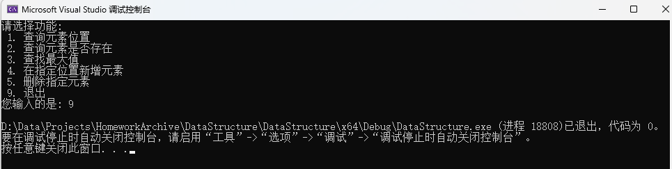

# 数据结构 - 实验报告2 —— 链表

## 实验题目 —— 链表的基本操作

#### 实验目的:

1. 掌握单链表的定义；

2. 掌握单链表的基本操作;

   

#### 实验内容:

定义一个存储整数类型数据元素的带头结点的单链表，完成链表上的如下操作：

1. 从键盘输入n个整数，使用头插法或者尾插法创建存储这些元素的单链表；

2. 打印单链表；

3. 求单链表的长度；

4. 根据指定的位置读取相应的数据元素值； 

5. 查找单链表中是否存在给定的元素e，若存在则返回True，否则返回False;

6. 求单链表中元素的最大值;

7. （选做）给定一个元素，插入到表中指定的位置之前； 

8. （选做）删除指定位置的元素；


#### 结构设计:

链表采用 `LinkList` 作为其对应结构

定义了结构 `LNode` 作为链表节点对应结构，其定义如下

```C++
typedef struct LNode {
	int value; // Node Value
	struct LNode* next; // Next Node
} LNode, *LinkList;
```

定义了关键字`status` 作为通用返回值，其根数据为`int`类型


#### 详细设计：

##### 函数大纲

- `InitList` 初始化单链表
- `CreateList` 用户输入并创建单链表
- `PrintList` 打印单链表
- `GetListLength` 获取链表长度
- `GetElement`: 获取链表指定位置的元素
- `SearchElement`: 在链表中查找指定元素是否存在
- `SearchMaximumElement`: 找到链表中的最大值
- `InsertElement`: 在链表指定位置插入元素
- `DeleteElement`: 删除链表指定位置的元素
- `main`: 主函数


#### 调试分析:

本次代码采用C++语言撰写，主要实现了一个单链表的基础功能，包括新增，删除，查询，打印等操作。


对代码进行调试与分析时，可能会遇到以下的问题与解决方法：

1. 内存泄露
   - 在整个程序中，定义了许多变量，这些变量在程序执行到最后也没有进行内存释放，如果程序长时间运行的情况下有几率引发内存泄漏的问题导致程序无法正常运行
   - 解决办法是添加一些gc代码在一些无用变量后面或者函数执行后进行内存释放操作防止内存泄漏
2. 错误处理
   - 在整个程序中并非每个可能出错的地方都有进行错误捕捉，因此如果遇到意外的错误时可能用户会发现程序突然崩溃消失
   - 解决办法是为每个函数套上一层try catch 防止意外错误
3. 数据健壮性
   - 在整段代码中其实有许多输入没有验证数据有效性，比如当用户输入了字符而不是数字时会导致一系列问题产生

#### 用户使用说明 与 测试结果:

测试数据： 链表List = { 1, 2, 3, 4, 5 }

1. 初始化链表
    
    
    

    | 测试数据      | 期望结果 | 实际结果 | 结果预期 |
    | ------------- | -------- | -------- | -------- |
    | 1, 2, 3, 4, 5 | 5        | 5        | 正常     |

  

2. 选择要使用的功能

   

3. 功能一：寻找元素位置

    

    | 测试数据 | 期望结果 | 实际结果 | 结果预期 |
    | -------- | -------- | -------- | -------- |
    | 4        | 4        | 4        | 正常     |

4. 功能二：查询元素是否存在

    

    

    

    | 测试数据 | 期望结果 | 实际结果 | 结果预期 |
    | -------- | -------- | -------- | -------- |
    | 20       | 不存在   | 不存在   | 正常     |
    | 3        | 存在     | 存在     | 正常     |

5. 功能三：查找最大值

    

    | 测试数据      | 期望结果 | 实际结果 | 结果预期 |
    | ------------- | -------- | -------- | -------- |
    | 1, 2, 3, 4, 5 | 5        | 5        | 正常     |

6. 功能四：在指定位置新增元素

    

    | 测试数据                      | 期望结果        | 实际结果        | 结果预期 |
    | ----------------------------- | --------------- | --------------- | -------- |
    | 添加元素：20 <br/>添加位置：3 | 1, 2,  20, 3, 4 | 1, 2,  20, 3, 4 | 正常     |

7. 功能五：删除指定位置的元素

    

    | 测试数据 | 期望结果   | 实际结果   | 结果预期 |
    | -------- | ---------- | ---------- | -------- |
    | 3        | 1, 2, 3, 4 | 1, 2, 3, 4 | 正常     |

8. 功能六：退出程序

    

#### 源代码:

```C++
#include <iostream>

using namespace std;

#pragma region -- Define --

#define OK 1;
#define ERROR -1;
#define OVERFLOW -2;

typedef int status;

/// <summary>
/// Link List Node 
/// </summary>
typedef struct LNode {
	int value; // Node Value
	struct LNode* next; // Next Node
} LNode, *LinkList;

#pragma endregion

#pragma region -- Functions --

status InitList(LinkList& List) {
	List = new LNode;
	List->next = NULL;
	return OK;
}

status CreateList (LinkList& List, int Length) {
	InitList(List);
	if (List == NULL) return OVERFLOW;

	int i, input;
	LNode* previous;
	LNode* node;

	previous = List;
	for (i = 0; i < Length; i++) {
		cin >> input;
		node = new LNode;
		if (node == NULL) return OVERFLOW;

		node->next = NULL;
		node->value = input;
		previous->next = node;
		previous = node;
	}
	return OK;
}

status PrintList(LinkList List, int Length) {
	for (int i = 0; i < Length; i++) {
		List = List->next;
		cout << List->value << " -> ";
	}
	cout << "NULL" << endl;
	return OK;
}

status GetListLength(LinkList List) {
	int i = 0;

	while (List->next != NULL)
	{
		List = List->next;
		i++;
	}
	cout << "链表长度为：" << i;
	return OK;
}

status GetElement(LinkList& List, int index) {
	for (int i = 0; i < index; i++) {
		List = List->next;
	}
	cout << List->value;
	return OK;
}

status InsertElement(LinkList& List, int index, int input) {
	if (index < 1) return OVERFLOW;
	
	int i;
	LinkList list = List;

	for (i = 1; list && i < index; i++) {
		list = list->next;
	}

	if (!list || i > index) return ERROR;

	LinkList temp = new LNode;
	temp->value = input;
	temp->next = list->next;
	list->next = temp;

	return OK;
}

status DeleteElement(LinkList& List, int index, int& Length) {
	int i;
	LinkList list = List;

	for (i = 0; list->next && i < index - 1; ++i) {
		list = list->next;
	}

	if (!list->next || i > index - 1) return OVERFLOW;

	LinkList Temp = list->next;
	list->next = Temp->next;
	delete Temp;
	Length -= 1;

	return OK;
}

bool SearchElement(LinkList& List, int input) {
	LNode* list;
	list = List;
	while (list->value != input && list->next != NULL)
	{
		list = list->next;
		if (list->next == NULL) return false;
	}
	return true;
}

status SearchMaximumElement(LinkList& List) {
	int max = 0;
	LNode* list;
	list = List;
	do
	{
		if (list->value > max) {
			max = list->value;
		}

		list = list->next;
	} while (list && list->value != NULL);
	cout << "链表中最大的值为：" << max;
	return OK;
}

#pragma endregion

#pragma region -- Main --

int main() {
	LinkList List;
	int Length, Feature, Number1, SearchNumber;

	#pragma region -- Init --
	cout << "请输入链表的长度: " << endl;
	cin >> Length;
	cout << "请输入元素并回车，重复该操作以创建链表：" << endl;
	CreateList(List, Length);
	system("cls");
	cout << "创建的链表为: " << endl;
	PrintList(List, Length);
	cout << endl;
	GetListLength(List);
	cout << endl;
	system("pause");
	#pragma endregion

	#pragma region -- Select --

	while (true)
	{
		system("cls");
		cout << "请选择功能: \n 1. 查询元素位置 \n 2. 查询元素是否存在 \n 3. 查找最大值 \n 4. 在指定位置新增元素 \n 5. 删除指定元素 \n 9. 退出" << endl;
		cout << "您输入的是: ";
		cin >> Feature;

		switch (Feature)
		{
		case 1:
			cout << "请输入要寻找的元素位置:" << endl;
			cin >> Number1;
			GetElement(List, Number1);
			cout << endl;
			break;
		case 2:
			cout << "请输入要寻找的元素:" << endl;
			cin >> SearchNumber;
			cout << "您要查找的元素" << (SearchElement(List, SearchNumber) ? "存在" : "不存在") << endl;
			break;
		case 3:
			SearchMaximumElement(List);
			cout << endl;
			break;
		case 4:
			int element;
			cout << "请输入要添加的元素:" << endl;
			cin >> element;
			cout << "请输入要插入的位置:" << endl;
			cin >> Number1;
			InsertElement(List, Number1, element);
			PrintList(List, Length);
			break;
		case 5:
			cout << "请输入要删除的元素位置:" << endl;
			cin >> Number1;
			DeleteElement(List, Number1, Length);
			PrintList(List, Length);
			break;
		case 9:
			return 0;
		default:
			cout << "输入的功能有误，请重新输入：" << endl;
			break;
		}

		system("pause");
	}

	#pragma endregion


	return 0;
}

#pragma endregion
```

