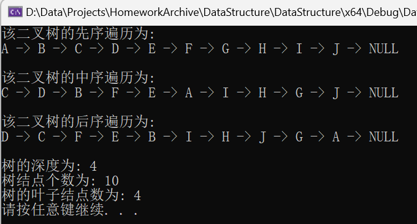

# 数据结构 - 实验报告5 —— 二叉树

## 实验题目 —— 二叉树的遍历

#### 实验目的:

1. 掌握二叉树的定义；

2. 掌握二叉树的遍历操作与应用；


#### 实验内容:

定义一个使用二叉链表存储的二叉树，数据元素类型为字符型，完成如下操作：

1. 从键盘输入二叉树的扩展先序遍历序列，创建二叉链表；

2. 递归算法实现二叉树的先序、中序、后序遍历；

3. 递归算法实现求二叉树中结点个数；

4. 递归算法实现求二叉树的高度；

5. (选做)递归算法实现求二叉树中叶子个数。


#### 结构设计:

定义了结构 `TreeNode` 作为链表节点对应结构，其定义如下

```C++
typedef struct TreeNode {
	char value; // Node Value
	struct TreeNode *left; // Left Tree
	struct TreeNode *right; // Right Tree
} TreeNode, *Tree;
```

定义了关键字`status` 作为通用返回值，其根数据为`int`类型


#### 详细设计：

##### 函数大纲

- `CreateTree`: 用户输入并创建二叉树
- `Preorder`: 先序遍历
- `MiddleOrder`: 中序遍历
- `Postorder`: 后序遍历
- `GetNodesCount`: 获取二叉树中结点个数
- `GetTreeDepth`: 获取二叉树高度
- `GetLeafNode`: 获取二叉树叶子结点个数
- `main`: 主函数


#### 调试分析:

本次代码采用C++语言撰写，主要实现了一个二叉树最基本的先、中、后序遍历方法，并实现了获取树深度、结点个数等功能。


对代码进行调试与分析时，可能会遇到以下的问题与解决方法：

1. 内存泄露
   - 本次编写为了简洁性并没有完善内存释放的代码，虽然在本次代码中会由程序退出进行内存释放，但实际编写至项目代码中时必须记得手动释放内存，以免意外错误发生

2. 数据健壮性
   - 本次代码撰写时对于一些可能为空的情况并没有过多完善，因为在正常逻辑中不应该也不能为空。但在实际项目中这是一个不可忽视的问题

#### 用户使用说明 与 测试结果:

测试数据： 二叉树 = `ABC*D**EF***GHI***J**`

在创建二叉树后会自动将所有功能执行一遍，具体如图



| 功能名                  | 测试结果   | 期望数据   | 预期类型 |
| ----------------------- | ---------- | ---------- | -------- |
| 先序遍历 | ABCDEFGHIJ | ABCDEFGHIJ | 正常     |
| 中序遍历 | CDBFEAIHGJ | CDBFEAIHGJ | 正常     |
| 后序遍历 | DCFEBIHJGA | DCFEBIHJGA | 正常     |
| 二叉树深度 | 4          | 4          | 正常     |
| 二叉树结点数 | 10         | 10         | 正常     |
| 二叉树叶子结点数 | 4          | 4          | 正常     |


#### 源代码:

```C++
#include <iostream>

using namespace std;

#pragma region -- Define --

#define OK 1;
#define ERROR -1;
#define OVERFLOW -2;

typedef int status;

/// <summary>
///  Binary Tree Node Structure
/// </summary>
typedef struct TreeNode {
	char value; // Node Value
	struct TreeNode *left; // Left Tree
	struct TreeNode *right; // Right Tree
} TreeNode, *Tree;


#pragma endregion

#pragma region -- Functions --

status CreateTree(Tree& tree) {
	char input;

	cout << "请输入要创建的二叉树扩展先序遍历序列(以*号代表空): " << endl;
	cin >> input;

	if (input == '*') {
		tree = NULL;
	}
	else {
		tree = new TreeNode;
		if (tree == NULL) return OVERFLOW;
		tree->value = input;
		CreateTree(tree->left);
		CreateTree(tree->right);
	}

	return OK;
}

void Preorder(Tree tree) {
	if (tree == NULL) return;

	cout << tree->value << " -> ";
	Preorder(tree->left);
	Preorder(tree->right);
}

void MiddleOrder(Tree tree) {
	if (tree == NULL) return;

	MiddleOrder(tree->left);
	cout << tree->value << " -> ";
	MiddleOrder(tree->right);
}

void Postorder(Tree tree) {
	if (tree == NULL) return;

	Postorder(tree->left);
	Postorder(tree->right);
	cout << tree->value << " -> ";
}

int GetNodesCount(Tree tree) {
	if (tree == NULL) return 0;

	int left = GetNodesCount(tree->left);
	int right = GetNodesCount(tree->right);
	int count = left + right + 1;
	
	return count;
}

int GetTreeDepth(Tree tree) {
	if (tree == NULL) return 0;

	return max(GetTreeDepth(tree->left), GetTreeDepth(tree->right)) + 1;
}

int GetLeafNode(Tree tree) {
	if (tree == NULL) return 0;
	if (tree->left == NULL && tree->right == NULL) return 1;

	return GetLeafNode(tree->left) + GetLeafNode(tree->right);
}

#pragma endregion

#pragma region -- Main --

int main() {
	Tree BinaryTree;

	CreateTree(BinaryTree);
	system("cls");

	cout << "该二叉树的先序遍历为: " << endl;
	Preorder(BinaryTree);
	cout << "NULL \n" << endl;

	cout << "该二叉树的中序遍历为: " << endl;
	MiddleOrder(BinaryTree);
	cout << "NULL \n" << endl;

	cout << "该二叉树的后序遍历为: " << endl;
	Postorder(BinaryTree);
	cout << "NULL \n" << endl;

	cout << "树的深度为: " << GetTreeDepth(BinaryTree) << endl;
	cout << "树结点个数为: " << GetNodesCount(BinaryTree) << endl;
	cout << "树的叶子结点数为: " << GetLeafNode(BinaryTree) << endl;

	system("pause");

	return OK;
}

#pragma endregion
```

