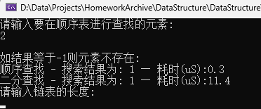
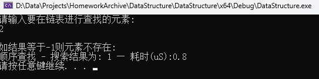

# 数据结构 - 实验报告6 —— 查找

## 实验题目 —— 查找表

#### 实验目的:

1. 掌握顺序查找和二分查找的算法思想；

2. 掌握顺序查找和二分查找的算法实现；


#### 实验内容:

- 使用顺序表作为存储结构完成以下操作：
  1. 编写算法实现顺序查找，如查找成功返回元素下标，否则返回0；

  1. 编写算法实现二分查找，如查找成功返回元素下标，否则返回0；


- 采用单链表作为存储结构实现顺序查找，若查找成功返回元素结点的指针，否则返回空指针NULL。

- 选做题：改进课上所讲的二分查找算法，如果有重复数据时，返回目标元素第一次出现的下标。如[1,2,2,2,2,3,6,8,9]中有多个2，查找时返回2第一次出现的下标。

- 选做题：在顺序表上实现哈希表的构造和哈希查找，哈希函数自行确定，解决冲突采用线性探测再散列。


#### 结构设计:

定义了结构 `SeqList` 作为顺序表结构，其定义如下

```C++
#include <iostream>

#ifndef SEQLIST_H
	#define SEQLIST_H

	typedef int ElementType; // 数据类型

	class SeqList {
	public:
		SeqList(int size = 0);
		~SeqList();

		bool isEmpty();
		int getLength();
		bool getElement(int index, ElementType* element);
		int getElement(int index);
		bool appendList(const ElementType element);
		bool insertList(int index, const ElementType element);
		bool deleteList(int index, ElementType* element);
		void printList();

	private:
		ElementType* p_DataArray; // 指向存放顺序表元素的数组
		int p_length; // 顺序表的当前长度
		int p_maxSize; // 顺序表的最大容量
	};
#endif

```


定义了结构 `LinkList` 作为顺序表结构，其定义如下

```C++
#include <iostream>

#ifndef LINKLIST_H
	#define LINKLIST_H

	typedef int ElementType; // 数据类型

	class LinkNode {
		friend class LinkList;
	private:
		ElementType value;
		LinkNode* next;
	};

	class LinkList {
	public:
		LinkList();
		~LinkList();

		bool isEmpty();
		int getLength();
		bool getElement(int index, ElementType* element);
		int getElement(int index);
		bool appendList(const ElementType element);
		bool insertList(int index, const ElementType element);
		bool deleteList(int index, ElementType* element);
		bool clearList();
		void printList();

	private:
		LinkNode* head;
	};
#endif
```


定义了关键字`status` 作为通用返回值，其根数据为`int`类型


#### 详细设计：

##### 函数大纲

- `CreateList`: 用户输入并创建顺序表
- `CreateLinkList`: 用户输入并创建单链表
- `SequentialSearch`: 顺序查找
- `BinarySearch`: 二分查找
- `main`: 主函数


#### 调试分析:

本次代码采用C++语言撰写，主要实现了顺序表与单链表的类定义以及顺序查找和二分查找功能。


对代码进行调试与分析时，可能会遇到以下的问题与解决方法：

1. 内存泄露
   - 本次编写为了简洁性并没有完善内存释放的代码，虽然在本次代码中会由程序退出进行内存释放，但实际编写至项目代码中时必须记得手动释放内存，以免意外错误发生

2. 数据健壮性
   - 本次代码撰写时对于一些可能为空的情况并没有过多完善，因为在正常逻辑中不应该也不能为空。但在实际项目中这是一个不可忽视的问题
   
     

#### 用户使用说明 与 测试结果:

测试数据： 顺序表&链表 ={1,2,2,2,2,3,6,8,9}


##### 顺序表



| 功能名                  | 测试结果   | 期望数据   | 预期类型 |
| ----------------------- | ---------- | ---------- | -------- |
| 顺序查找 | 1 | 1          | 正常     |
| 二分查找 | 1 | 1 | 正常     |


##### 链表



| 功能名                  | 测试结果   | 期望数据   | 预期类型 |
| ----------------------- | ---------- | ---------- | -------- |
| 顺序查找 | 1 | 1          | 正常     |


#### 源代码:


##### 顺序表 - 头文件

```C++
#include <iostream>

#ifndef SEQLIST_H
	#define SEQLIST_H

	typedef int ElementType; // 数据类型

	class SeqList {
	public:
		SeqList(int size = 0);
		~SeqList();

		bool isEmpty();
		int getLength();
		bool getElement(int index, ElementType* element);
		int getElement(int index);
		bool appendList(const ElementType element);
		bool insertList(int index, const ElementType element);
		bool deleteList(int index, ElementType* element);
		void printList();

	private:
		ElementType* p_DataArray; // 指向存放顺序表元素的数组
		int p_length; // 顺序表的当前长度
		int p_maxSize; // 顺序表的最大容量
	};
#endif
```

##### 顺序表 - 函数文件

```C++
#include "SequenceList.h"

#pragma region -- Functions --
// 构造函数
SeqList::SeqList(int size)
{
	p_maxSize = size;
	p_DataArray = new ElementType[p_maxSize];
	p_length = 0;
}

// 析构函数
SeqList::~SeqList()
{
	delete[] p_DataArray;
	p_DataArray = nullptr;
}

// 判断是否为空操作
bool SeqList::isEmpty()
{
	return p_length == 0 ? true : false;
}

// 获取顺序表长度操作
int SeqList::getLength()
{
	return p_length;
}

// 获取元素操作
bool SeqList::getElement(int index, ElementType* element)
{
	if (p_length == 0 || index < 0 || index > p_length) return false;

	*element = p_DataArray[index];
	return true;
}
int SeqList::getElement(int index)
{
	if (p_length == 0 || index < 0 || index > p_length) return -1;

	return p_DataArray[index];
}

// 新增元素操作
bool SeqList::appendList(const ElementType element)
{
	if (p_length >= p_maxSize) return false;

	p_DataArray[p_length] = element;
	p_length++;

	return true;
}

// 插入元素操作
bool SeqList::insertList(int index, const ElementType element)
{
	if (p_length >= p_maxSize || index<0 || index>p_length) return false;

	if (index <= p_length - 1)
	{
		for (int k = p_length - 1; k >= index; k--)
		{
			p_DataArray[k + 1] = p_DataArray[k];
		}
	}

	p_DataArray[index] = element;
	p_length++;

	return true;
}

// 删除元素操作
bool SeqList::deleteList(int index, ElementType* element)
{
	if (p_length == 0 || index<0 || index>p_length - 1) return false;

	*element = p_DataArray[index];

	if (index != p_length - 1)
	{
		for (int k = index; k < p_length - 1; k++) {
			p_DataArray[k] = p_DataArray[k + 1];
		}
	}

	p_length--;

	return true;
}

// 遍历顺序表
void SeqList::printList()
{
	if (p_DataArray == nullptr || p_length == 0) return;

	for (int index = 0; index < p_length; index++)
	{
		std::cout << p_DataArray[index] << " -> ";
	}
	std::cout << "NULL" << std::endl;
}
#pragma endregion
```


##### 链表 - 头文件

```C++
#include <iostream>

#ifndef LINKLIST_H
	#define LINKLIST_H

	typedef int ElementType; // 数据类型

	class LinkNode {
		friend class LinkList;
	private:
		ElementType value;
		LinkNode* next;
	};

	class LinkList {
	public:
		LinkList();
		~LinkList();

		bool isEmpty();
		int getLength();
		bool getElement(int index, ElementType* element);
		int getElement(int index);
		bool appendList(const ElementType element);
		bool insertList(int index, const ElementType element);
		bool deleteList(int index, ElementType* element);
		bool clearList();
		void printList();

	private:
		LinkNode* head;
	};
#endif
```

##### 链表 - 函数文件

```C++
#include "LinkList.h"

#pragma region -- Functions --
// 构造函数
LinkList::LinkList()
{
	head = new LinkNode;
	head->next = nullptr;
}

// 析构函数
LinkList::~LinkList()
{
	delete head;
	head = nullptr;
}

// 判断是否为空操作
bool LinkList::isEmpty()
{
	return head == nullptr ? true : false;
}

// 获取链表长度操作
int LinkList::getLength()
{
	int count = 0;
	LinkNode* temp = head->next;

	while (temp != nullptr)
	{
		count++;
		temp = temp->next;
	}

	return count;
}

// 获取元素操作
bool LinkList::getElement(int index, ElementType* element)
{
	LinkNode* temp = head->next;

	if (temp == nullptr || index < 0 || index > getLength()) return false;

	for (int i = 0; i < index; i++) {
		temp = temp->next;
	}
	*element = temp->value;
	return true;
}
int LinkList::getElement(int index)
{
	LinkNode* temp = head->next;

	if (temp == nullptr || index < 0 || index > getLength()) return -1;

	for (int i = 0; i < index; i++) {
		temp = temp->next;
	}
	return temp->value;
}

// 新增元素操作
bool LinkList::appendList(const ElementType element)
{
	if (head == nullptr) return false;

	LinkNode* per = head;
	for (int i = 0; i < getLength(); i++)
	{
		per = per->next;
	}
	LinkNode* newNode = new LinkNode;
	newNode->value = element;
	newNode->next = nullptr;
	per->next = newNode;

	return true;
}

// 插入元素操作
bool LinkList::insertList(int index, const ElementType element)
{
	if (index < 0 || index > getLength()) return false;

	LinkNode* per = head;
	for (int i = 0; i < index; i++)
	{
		per = per->next;
	}
	LinkNode* newNode = new LinkNode;
	newNode->value = element;
	newNode->next = per->next;
	per->next = newNode;

	return true;
}

// 删除元素操作
bool LinkList::deleteList(int index, ElementType* element)
{
	if (index < 0 || index > getLength()) return false;

	LinkNode* per = head;
	for (int i = 0; i < index; i++)
	{
		per = per->next;
	}
	LinkNode* temp = per->next;
	per->next = per->next->next;
	delete temp;

	return true;
}

// 清空链表操作
bool LinkList::clearList()
{
	while (head->next != NULL)
	{
		LinkNode* node = head->next;
		head->next = head->next->next;
		delete node;
	}

	return true;
}

// 遍历链表
void LinkList::printList()
{
	LinkNode* temp = head;
	while (temp->next != nullptr)
	{
		temp = temp->next;
		std::cout << temp->value << " -> ";
	}

	std::cout << "NULL" << std::endl;
}
#pragma endregion
```


##### 主文件

```C++
#include <iostream>
#include <windows.h>
#include "SequenceList.h"
#include "LinkList.h"

using namespace std;

#pragma region -- Define --

#define OK 1;
#define ERROR -1;
#define OVERFLOW -2;

typedef int status;

#pragma endregion

#pragma region -- Functions --

status CreateList(SeqList& seqList, int Maxsize) {
	int i, input;
	for (i = 0; i < Maxsize; i++) {
		cin >> input;
		seqList.appendList(input);
	}

	return OK;
}

status CreateLinkList(LinkList& linkList, int Length) {
	int i, input;
	for (i = 0; i < Length; i++) {
		cin >> input;
		linkList.appendList(input);
	}

	return OK;
}

int SequentialSearch(SeqList& seqList, int element) {
	int i = 0, result = NULL;

	while (result != element)
	{
		i++;
		if (!seqList.getElement(i, &result)) return -1;
	}

	return i;
}
int SequentialSearch(LinkList& linkList, int element) {
	int i = 0, result = NULL;

	while (result != element)
	{
		i++;
		result = linkList.getElement(i);
		if (result == -1) return -1;
	}

	return i;
}

int BinarySearch(SeqList& seqList, int element) {
	int low = 1, high = seqList.getLength(), mid = 0;

	if (seqList.getElement(low) == element) return low;
	if (seqList.getElement(high) == element) return high;

	while (low <= high)
	{
		mid = (low + high) / 2;

		if (element < seqList.getElement(mid))
			high = mid - 1;
		else if (element > seqList.getElement(mid))
			low = mid + 1;
		else
			return mid;
	}
	return 0;
}

#pragma endregion

#pragma region -- Main --

int main() {
	LinkList linkList;
	int Maxsize, Length;
	int input, result;

	LARGE_INTEGER t1, t2, tc; // 计时器函数

	#pragma region -- SeqList --

	cout << "请输入顺序表的长度: " << endl;
	cin >> Maxsize;
	SeqList seqList(Maxsize);
	cout << "请输入元素并回车，重复该操作以创建顺序表：" << endl;
	CreateList(seqList, Maxsize);
	system("cls");

	cout << "请输入要在顺序表进行查找的元素: " << endl;
	cin >> input;

	cout << endl;
	cout << "如结果等于-1则元素不存在:" << endl;

	QueryPerformanceFrequency(&tc);
	QueryPerformanceCounter(&t1);
	result = SequentialSearch(seqList, input);
	QueryPerformanceCounter(&t2);
	cout << "顺序查找 - 搜索结果为: " << result << " — 耗时(uS):" << (t2.QuadPart - t1.QuadPart) * 1000000.0 / (double)tc.QuadPart << endl;

	QueryPerformanceCounter(&t1);
	result = BinarySearch(seqList, input);
	QueryPerformanceCounter(&t2);
	cout << "二分查找 - 搜索结果为: " << result << " — 耗时(uS):" << (t2.QuadPart - t1.QuadPart) * 1000000.0 / (double)tc.QuadPart << endl;

	#pragma endregion

	#pragma region -- LinkList --

	cout << "请输入链表的长度: " << endl;
	cin >> Length;
	cout << "请输入元素并回车，重复该操作以创建链表：" << endl;
	CreateLinkList(linkList, Length);
	system("cls");

	cout << "请输入要在链表进行查找的元素: " << endl;
	cin >> input;

	cout << endl;
	cout << "如结果等于-1则元素不存在:" << endl;

	QueryPerformanceFrequency(&tc);
	QueryPerformanceCounter(&t1);
	result = SequentialSearch(linkList, input);
	QueryPerformanceCounter(&t2);
	cout << "顺序查找 - 搜索结果为: " << result << " — 耗时(uS):" << (t2.QuadPart - t1.QuadPart) * 1000000.0 / (double)tc.QuadPart << endl;

	#pragma endregion

	system("pause");

	return OK;
}

#pragma endregion
```
