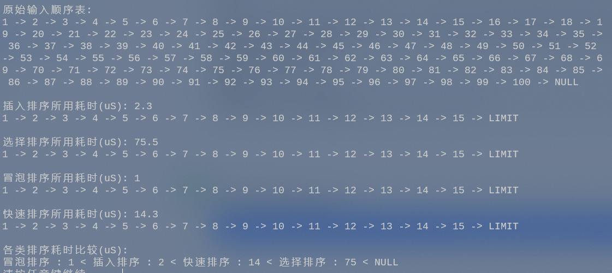
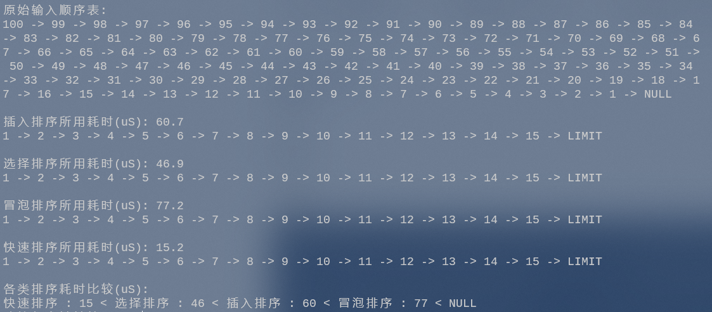
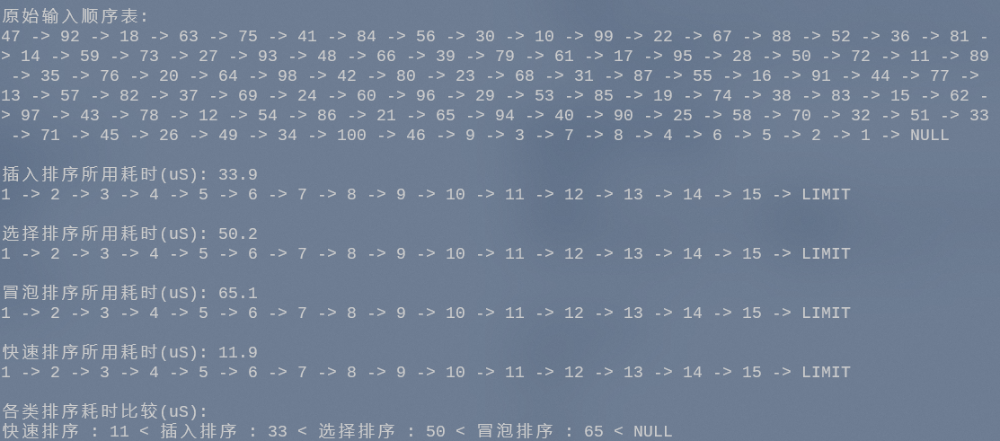

# 数据结构 - 实验报告7 —— 排序

## 实验题目 —— 排序

#### 实验目的:

1. 掌握简单排序算法的基本思想和实现；

2. 复习顺序表的基本操作和应用；


#### 实验内容:

- 假设顺序表中存放整数类型的数据元素，分别采用直接插入排序、简单选择排序、冒泡排序算法实现对顺序表的升序排序。具体要求：
  
1. 从键盘输入n个数据元素，存放在顺序表中；
2. 分别实现三种排序算法对顺序表进行从小到大排序，并在主函数中调用和测试；
3. （选做）打印排序过程中每一趟排序后的元素序列，并在主函数中调用和测试；
4. （选做）使用快速排序算法对顺序表进行从小到大排序，并在主函数中调用和测试；


#### 结构设计:

定义了结构 `SeqList` 作为顺序表结构，其定义如下

```C++
#include <iostream>

#ifndef SEQLIST_H
	#define SEQLIST_H

	typedef int ElementType; // 数据类型

	class SeqList {
	public:
		SeqList(int size = 0);
		SeqList(const SeqList &seqList);
		~SeqList();

		bool isEmpty();
		int getLength();
		bool getElement(int index, ElementType* element);
		int getElement(int index);
		bool swapElement(int index1, int index2);
		bool appendList(const ElementType element);
		bool insertList(int index, const ElementType element);
		bool deleteList(int index, ElementType* element);
		void printList();
		void printList(int limit);

	private:
		ElementType* p_DataArray; // 指向存放顺序表元素的数组
		int p_length; // 顺序表的当前长度
		int p_maxSize; // 顺序表的最大容量
	};
#endif

```

定义了关键字`status` 作为通用返回值，其根数据为`int`类型


#### 详细设计：

##### 函数大纲

- `CreateSeqList`: 用户输入并创建顺序表

- `SelectionSort`: 选择排序

- `BubbleSort`: 冒泡排序

- `InsertionSort`: 插入排序

- `QuickSort`: 快速排序

- `main`: 主函数

  

> 以下为辅助函数

- `getMedian`: 选取三个元素的中位数
- `partition`: 哨兵划分 - 三数取中
- `calcTime`: 计算运行时间
- `compare`: 比较函数


#### 调试分析:

本次代码采用C++语言撰写，主要实现了顺序表，并基于顺序表进行选择排序、冒泡排序、插入排序与快速排序。


对代码进行调试与分析时，可能会遇到以下的问题与解决方法：

1. 内存泄露
   - 本次编写为了简洁性并没有完善内存释放的代码，虽然在本次代码中会由程序退出进行内存释放，但实际编写至项目代码中时必须记得手动释放内存，以免意外错误发生

2. 数据健壮性
   - 本次代码撰写时对于一些可能为空的情况并没有过多完善，因为在正常逻辑中不应该也不能为空。但在实际项目中这是一个不可忽视的问题

3. 运行时间

   - 本次代码中的算法并不是最优解，运行时会有很多可优化的空间，在实际项目中一堆的时间加在一起就是不可估量的灾难

   

#### 用户使用说明 与 测试结果:

测试数据如下：

| 最好情况                         | 最坏情况                         | 一般情况                        |
| -------------------------------- | -------------------------------- | ------------------------------- |
| 1, 2, 3, 4, ..., 97, 98, 99, 100 | 100, 99, 98, 97, ..., 4, 3, 2, 1 | 47, 92, 18, 63, ..., 6, 5, 2, 1 |


对应的运行结果如下：

###### 最好情况



###### 最坏情况



###### 一般情况




#### 源代码:


##### 顺序表 - 头文件

```C++
#include <iostream>

#ifndef SEQLIST_H
	#define SEQLIST_H

	typedef int ElementType; // 数据类型

	class SeqList {
	public:
		SeqList(int size = 0);
		SeqList(const SeqList &seqList);
		~SeqList();

		bool isEmpty();
		int getLength();
		bool getElement(int index, ElementType* element);
		int getElement(int index);
		bool swapElement(int index1, int index2);
		bool appendList(const ElementType element);
		bool insertList(int index, const ElementType element);
		bool deleteList(int index, ElementType* element);
		void printList();
		void printList(int limit);

	private:
		ElementType* p_DataArray; // 指向存放顺序表元素的数组
		int p_length; // 顺序表的当前长度
		int p_maxSize; // 顺序表的最大容量
	};
#endif
```


##### 顺序表 - 函数文件

```C++
#include "SequenceList.h"

#pragma region -- Functions --
// 构造函数
SeqList::SeqList(int size)
{
	p_maxSize = size;
	p_DataArray = new ElementType[p_maxSize];
	p_length = 0;
}
SeqList::SeqList(const SeqList &seqList)
{
	p_maxSize = seqList.p_maxSize;
	p_length = seqList.p_length;

	p_DataArray = new ElementType[p_maxSize];

	for (int i = 0; i < p_length; i++) {
		p_DataArray[i] = seqList.p_DataArray[i];
	}
}

// 析构函数
SeqList::~SeqList()
{
	delete[] p_DataArray;
}

// 判断是否为空操作
bool SeqList::isEmpty()
{
	return p_length == 0 ? true : false;
}

// 获取顺序表长度操作
int SeqList::getLength()
{
	return p_length;
}

// 获取元素操作
bool SeqList::getElement(int index, ElementType* element)
{
	if (p_length == 0 || index < 0 || index > p_length) return false;

	*element = p_DataArray[index];
	return true;
}
int SeqList::getElement(int index)
{
	if (p_length == 0 || index < 0 || index > p_length) return -1;

	return p_DataArray[index];
}

// 交换元素操作
bool SeqList::swapElement(int index1, int index2) {
	try
	{
		ElementType temp = p_DataArray[index2];
		p_DataArray[index2] = p_DataArray[index1];
		p_DataArray[index1] = temp;
		return true;
	}
	catch (const std::exception&)
	{
		return false;
	}
}

// 新增元素操作
bool SeqList::appendList(const ElementType element)
{
	if (p_length >= p_maxSize) return false;

	p_DataArray[p_length] = element;
	p_length++;

	return true;
}

// 插入元素操作
bool SeqList::insertList(int index, const ElementType element)
{
	if (p_length >= p_maxSize || index<0 || index>p_length) return false;

	if (index <= p_length - 1)
	{
		for (int k = p_length - 1; k >= index; k--)
		{
			p_DataArray[k + 1] = p_DataArray[k];
		}
	}

	p_DataArray[index] = element;
	p_length++;

	return true;
}

// 删除元素操作
bool SeqList::deleteList(int index, ElementType* element)
{
	if (p_length == 0 || index<0 || index>p_length - 1) return false;

	*element = p_DataArray[index];

	if (index != p_length - 1)
	{
		for (int k = index; k < p_length - 1; k++) {
			p_DataArray[k] = p_DataArray[k + 1];
		}
	}

	p_length--;

	return true;
}

// 遍历顺序表
void SeqList::printList()
{
	if (p_DataArray == nullptr || p_length == 0) return;

	for (int index = 0; index < p_length; index++)
	{
		std::cout << p_DataArray[index] << " -> ";
	}
	std::cout << "NULL" << std::endl;
}
void SeqList::printList(int limit)
{
	if (p_DataArray == nullptr || p_length == 0) return;

	for (int index = 0; index < (p_length > limit ? limit : p_length); index++)
	{
		std::cout << p_DataArray[index] << " -> ";
	}
	std::cout << "LIMIT" << std::endl;
}
#pragma endregion
```


##### 主文件

```C++
#include <iostream>
#include <iomanip>
#include <map>
#include <vector>
#include <algorithm>
#include <windows.h>
#include "SequenceList.h"

using namespace std;

#pragma region -- Define --

#define OK 1;
#define ERROR -1;
#define OVERFLOW -2;

typedef int status;

#pragma endregion

#pragma region -- Functions --

status CreateSeqList(SeqList& seqList, int Maxsize) {
	int i, input;
	for (i = 0; i < Maxsize; i++) {
		cin >> input;
		seqList.appendList(input);
	}

	return OK;
}

status SelectionSort(SeqList& seqList) {
	if (seqList.isEmpty()) return OVERFLOW;

	int n = seqList.getLength();

	// 外循环：未排序区间为 [i, n-1]
	for (int i = 0; i < n - 1; i++) {
		// 内循环：找到未排序区间内的最小元素
		int k = i;
		for (int j = i + 1; j < n; j++) {
			if (seqList.getElement(j) < seqList.getElement(k)) k = j; // 记录最小元素的索引
		}
		seqList.swapElement(i, k);
	}

	return OK;
}

status BubbleSort(SeqList& seqList) {
	if (seqList.isEmpty()) return OVERFLOW;

	int n = seqList.getLength();

	// 外循环：未排序区间为 [0, i]
	for (int i = n - 1; i > 0; i--) {
		bool flag = false; // 交换事件标记

		// 内循环：将未排序区间 [0, i] 中的最大元素交换至该区间的最右端
		for (int j = 0; j < i; j++) {
			if (seqList.getElement(j) > seqList.getElement(j + 1)) {
				// 交换 j和 j + 1
				seqList.swapElement(j, j + 1);

				flag = true; // 交换事件记录
			}
		}

		if (!flag) break; // 未交换任何元素，直接跳出
	}

	return OK;
}

status InsertionSort(SeqList& seqList) {
	for (int i = 1; i < seqList.getLength(); i++) {
		ElementType key;
		seqList.getElement(i, &key);

		int j = i - 1;

		while (j >= 0 && seqList.getElement(j) > key) {
			ElementType element;
			seqList.getElement(j, &element);
			seqList.swapElement(j + 1, j);
			j--;
		}

		seqList.insertList(j + 1, key);
	}
	return OK;
}

/* 选取三个元素的中位数 */
int getMedian(SeqList& seqList, int left, int mid, int right) {
	// 此处使用异或运算来简化代码
	if ((seqList.getElement(left) < seqList.getElement(mid)) ^ (seqList.getElement(left) < seqList.getElement(right))) return left;
	else if ((seqList.getElement(mid) < seqList.getElement(left)) ^ (seqList.getElement(mid) < seqList.getElement(right))) return mid;
	else return right;
}
/* 哨兵划分（三数取中值） */
int partition(SeqList& seqList, int left, int right) {
	// 选取三个候选元素的中位数
	int median = getMedian(seqList, left, (left + right) / 2, right);
	// 中位数放到最左边
	seqList.swapElement(left, median);
	// 以左指针为基准数
	int i = left, j = right;

	while (i < j) {
		while (i < j && seqList.getElement(j) >= seqList.getElement(left)) {
			j--; // 从右向左找首个小于基准数的元素
		}
			
		while (i < j && seqList.getElement(i) <= seqList.getElement(left)) {
			i++; // 从左向右找首个大于基准数的元素
		}

		seqList.swapElement(i, j);
	}

	seqList.swapElement(i, left);// 交换分界线
	return i;            // 返回基准数的索引
}
status QuickSort(SeqList& seqList, int left, int right) {
	// 数组长度为 1 时终止
	if (left < right) {
		// 哨兵划分操作
		int pivot = partition(seqList, left, right);
		// 对两个子数组中较短的那个执行快速排序
		if (pivot - left < right - pivot) {
			QuickSort(seqList, left, pivot - 1); // 递归排序左子数组
			QuickSort(seqList, pivot + 1, right); // 递归排序右子数组
		}
		else {
			QuickSort(seqList, pivot + 1, right); // 递归排序右子数组
			QuickSort(seqList, left, pivot - 1); // 递归排序左子数组
		}
	}
	return OK;
}

double calcTime(LARGE_INTEGER t1, LARGE_INTEGER t2, LARGE_INTEGER tc) {
	return (t2.QuadPart - t1.QuadPart) * 1000000.0 / (double)tc.QuadPart;
}
bool compare(const pair<string, int>& v1, const pair<string, int>& v2)
{
	return v1.second < v2.second;
}

#pragma endregion

#pragma region -- Main --

int main() {
	int Maxsize, Length;
	int input, result;

	LARGE_INTEGER t1, t2, tc; // 计时器函数

	cout << "请输入顺序表的长度: " << endl;
	cin >> Maxsize;
	SeqList seqList(Maxsize);
	cout << "请输入元素并回车，重复该操作以创建顺序表：" << endl;
	CreateSeqList(seqList, Maxsize);
	system("cls");

	cout << "原始输入顺序表:" << endl;
	seqList.printList();
	cout << endl;

	double sort0, sort1, sort2, sort3;
	QueryPerformanceFrequency(&tc);

	const char* names[] = { "插入", "选择", "冒泡", "快速" };
	double times[4];

	for (int i = 0; i < 4; i++)
	{
		SeqList seqList_temp(seqList);
		QueryPerformanceCounter(&t1);

		switch (i)
		{
		case 0:
			InsertionSort(seqList_temp);
			break;
		case 1:
			SelectionSort(seqList_temp);
			break;
		case 2:
			BubbleSort(seqList_temp);
			break;
		case 3:
			QuickSort(seqList_temp, 0, seqList_temp.getLength() - 1);
			break;
		default:
			break;
		}

		QueryPerformanceCounter(&t2);
		times[i] = calcTime(t1, t2, tc);
		cout << names[i] << "排序所用耗时(uS): " << times[i] << endl;
		seqList_temp.printList(15);
		cout << endl;
	}

	map<string, int> sort_map;

	for (int i = 0; i < 4; i++) {
		sort_map.insert(pair<string, int>(names[i], times[i]));
	}

	vector<pair<string, int>> vector_map(sort_map.begin(), sort_map.end());
	sort(vector_map.begin(), vector_map.end(), compare);

	cout << "各类排序耗时比较(uS):" << endl;
	for (auto item : vector_map)
	{
		cout << item.first << "排序" << " : " << item.second << " < ";
	}
	cout << "NULL" << endl;
	system("pause");

	return OK;
}

#pragma endregion

```

