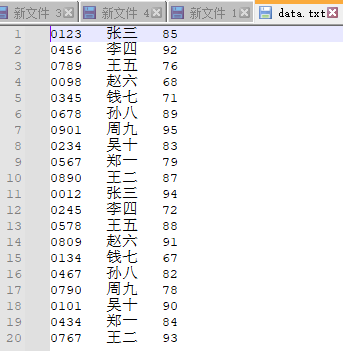
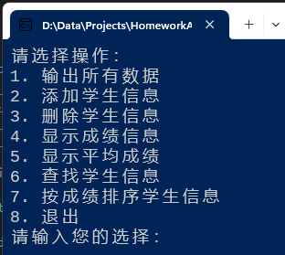
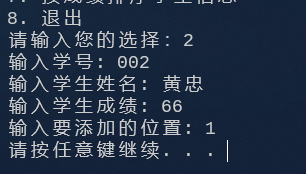
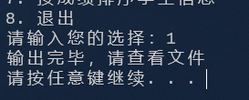
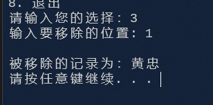
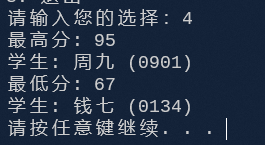
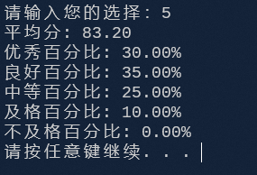
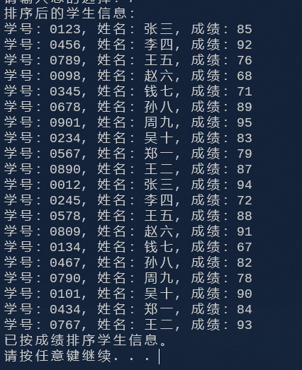

# 数据结构 - 实验报告8 —— 简易学生成绩管理系统

## 实验题目 —— 简易学生成绩管理系统

#### 实验目的:

1. 进一步提高对插入和删除等操作的理解和应用能力；

2. 进一步掌握重要的查找和排序算法；

3. 综合运用所学数据结构知识，提高解决实际问题的能力。


#### 实验内容:

- 设计并实现一个简易学生成绩管理系统，即定义一个包含学生信息（学号，姓名，成绩）的顺序 表，可以不考虑重名的情况，系统至少包含以下功能： 
  - 根据指定学生个数，逐个输入学生信息（可以采用文件输入）； 
  - 逐个显示学生表中所有学生的相关信息（可以采用文件输出）； 
  - 给定一个学生信息，插入到表中指定的位置； 
  - 删除指定位置的学生记录； 
  - 求学生成绩的最高分和最低分，并返回最高分和最低分的学生学号和姓名，若有多个最高分或最低 分，则需要返回所有最高、最低分的学生信息； 
  - 统计学生成绩的平均值，以及每个分数段学生的百分比，分数段分为：优秀（大于等于90分），良 好（小于90分大于等于80分），中等（小于80分大于等于70分），及格（小于70分大于等于60 分），不及格（小于60分）； 
  - 利用查找算法根据姓名进行查找，返回此学生的学号和成绩； 
  - 利用排序算法对学生按照成绩从低到高进行排序，排序算法自行选择


#### 结构设计:

定义了结构 `Student` 作为学生结构，其定义如下

```C++
typedef struct {
	char id[10];
	char name[20];
	int score;
} Student;
```

定义了结构 `ScoreInfo` 作为分数详情结构，其定义如下

```C++
struct ScoreInfo {
	int highestScore;
	vector<Student> highestScorers;
	int lowestScore;
	vector<Student> lowestScorers;
};
```

定义了结构 `ScoreStatistics` 作为分数统计结构，其定义如下

```C++
struct ScoreStatistics {
	double average;
	double excellentPercent; // 优秀（>=90）
	double goodPercent; // 良好（80-89）
	double mediumPercent; // 中等（70-79）
	double passPercent; // 及格（60-69）
	double failPercent; // 不及格（<60）
};
```

定义了结构 `SearchResult` 作为搜索结果结构，其定义如下

```C++
struct SearchResult {
	bool isFound;
	char id[10];
	int score;
};
```

定义了结构 `SeqList` 作为顺序表结构，源码过长不在此处展示，将放于最后源代码中


#### 详细设计：

##### 函数大纲

- `readFromFile`: 读取数据文件并加载

- `addStudent`: 添加学生到指定位置

- `deleteStudent`: 在指定位置删除学生

- `getScoreInfo`: 获取分数信息

- `calcScoreStatistics`: 统计学生分数

- `findStudentByName`: 根据学生姓名查询学生

- `bubbleSortByScore`: 冒泡排序学生信息

- `main`: 主函数

> 在本次开发中用到了 **模板类** 与 **反射** 的特性，因为在实际开发途中我们并不能硬编码结构体的成员，因此在本次开发采用以上两种特性以提高泛用性

#### 调试分析:

本次代码采用C++语言撰写，主要实现了一个简易学生成绩管理系统，其中包括了查询学生，新增学生，删除学生，为学生排序，统计分数等功能。


对代码进行调试与分析时，可能会遇到以下的问题与解决方法：

> 有些肯定会有的问题就不在此过多赘述，避免篇幅过长
> 如： 内存泄漏，数据健壮性保证等

1. 冗余的功能实现
   - 本次编写程序时，并没有过多的对顺序表类(Sequence List)进行过多的优化处理，比如获取元素就有常用和不常用的两种写法，虽然都可以使用但是执行效率上确实差的有点远

2. 类型定义
   - 本次编写时并没有过多考虑类型问题，基本上是奔着 any 类型走，但是在实际开发中这是严令禁止的。会引发非常多未知问题

   

#### 用户使用说明 与 测试结果:

测试数据：


##### 选择功能



##### 添加学生



##### 输出数据




##### 删除学生



##### 显示成绩



##### 计算平均成绩



##### 按成绩排序



##### 查找学生信息


#### 源代码:
