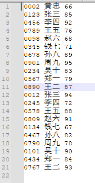

# 数据结构 - 实验报告8 —— 简易学生成绩管理系统

## 实验题目 —— 简易学生成绩管理系统

#### 实验目的:

1. 进一步提高对插入和删除等操作的理解和应用能力；

2. 进一步掌握重要的查找和排序算法；

3. 综合运用所学数据结构知识，提高解决实际问题的能力。


#### 实验内容:

- 设计并实现一个简易学生成绩管理系统，即定义一个包含学生信息（学号，姓名，成绩）的顺序 表，可以不考虑重名的情况，系统至少包含以下功能： 
  - 根据指定学生个数，逐个输入学生信息（可以采用文件输入）； 
  - 逐个显示学生表中所有学生的相关信息（可以采用文件输出）； 
  - 给定一个学生信息，插入到表中指定的位置； 
  - 删除指定位置的学生记录； 
  - 求学生成绩的最高分和最低分，并返回最高分和最低分的学生学号和姓名，若有多个最高分或最低 分，则需要返回所有最高、最低分的学生信息； 
  - 统计学生成绩的平均值，以及每个分数段学生的百分比，分数段分为：优秀（大于等于90分），良 好（小于90分大于等于80分），中等（小于80分大于等于70分），及格（小于70分大于等于60 分），不及格（小于60分）； 
  - 利用查找算法根据姓名进行查找，返回此学生的学号和成绩； 
  - 利用排序算法对学生按照成绩从低到高进行排序，排序算法自行选择


#### 结构设计:

定义了结构 `Student` 作为学生结构，其定义如下

```C++
typedef struct {
	char id[10];
	char name[20];
	int score;
} Student;
```

定义了结构 `ScoreInfo` 作为分数详情结构，其定义如下

```C++
struct ScoreInfo {
	int highestScore;
	vector<Student> highestScorers;
	int lowestScore;
	vector<Student> lowestScorers;
};
```

定义了结构 `ScoreStatistics` 作为分数统计结构，其定义如下

```C++
struct ScoreStatistics {
	double average;
	double excellentPercent; // 优秀（>=90）
	double goodPercent; // 良好（80-89）
	double mediumPercent; // 中等（70-79）
	double passPercent; // 及格（60-69）
	double failPercent; // 不及格（<60）
};
```

定义了结构 `SearchResult` 作为搜索结果结构，其定义如下

```C++
struct SearchResult {
	bool isFound;
	char id[10];
	int score;
};
```

定义了结构 `SeqList` 作为顺序表结构，源码过长不在此处展示，将放于最后源代码中


#### 详细设计：

##### 函数大纲

- `readFromFile`: 读取数据文件并加载

- `addStudent`: 添加学生到指定位置

- `deleteStudent`: 在指定位置删除学生

- `getScoreInfo`: 获取分数信息

- `calcScoreStatistics`: 统计学生分数

- `findStudentByName`: 根据学生姓名查询学生

- `bubbleSortByScore`: 冒泡排序学生信息

- `main`: 主函数

> 在本次开发中用到了 **模板类** 与 **反射** 的特性，因为在实际开发途中我们并不能硬编码结构体的成员，因此在本次开发采用以上两种特性以提高泛用性

#### 调试分析:

本次代码采用C++语言撰写，主要实现了一个简易学生成绩管理系统，其中包括了查询学生，新增学生，删除学生，为学生排序，统计分数等功能。


对代码进行调试与分析时，可能会遇到以下的问题与解决方法：

> 有些肯定会有的问题就不在此过多赘述，避免篇幅过长
> 如： 内存泄漏，数据健壮性保证等

1. 冗余的功能实现
   - 本次编写程序时，并没有过多的对顺序表类(Sequence List)进行过多的优化处理，比如获取元素就有常用和不常用的两种写法，虽然都可以使用但是执行效率上确实差的有点远

2. 类型定义
   - 本次编写时并没有过多考虑类型问题，基本上是奔着 any 类型走，但是在实际开发中这是严令禁止的。会引发非常多未知问题

   

#### 用户使用说明 与 测试结果:

测试数据：


##### 选择功能


##### 添加学生


##### 输出数据




##### 删除学生


##### 显示成绩


##### 计算平均成绩


##### 按成绩排序


##### 查找学生信息


#### 源代码:

##### 顺序表 - 定义

```C++
#include <iostream>

#ifndef SEQLIST_H
	#define SEQLIST_H

	template <typename ElementType> //数据类型
	class SeqList {
	public:
		SeqList(int size = 0);
		SeqList(const SeqList<ElementType> &seqList);
		~SeqList();

		bool isEmpty();
		int getLength();
		bool getElement(int index, ElementType* element);
		ElementType getElement(int index);
		bool swapElement(int index1, int index2);
		bool appendList(const ElementType element);
		bool insertList(int index, const ElementType element);
		bool deleteList(int index, ElementType* element);
		void printList();
		void printList(int limit);
		void printList(const char* filename);

	private:
		ElementType* p_DataArray; // 指向存放顺序表元素的数组
		int p_length; // 顺序表的当前长度
		int p_maxSize; // 顺序表的最大容量
	};
#endif
```

##### 顺序表 - 实现

```C++
#include "SequenceList.h"
#include <fstream>

#pragma region -- Functions --
// 构造函数
template <typename ElementType>
SeqList<ElementType>::SeqList(int size)
{
	p_maxSize = size;
	p_DataArray = new ElementType[p_maxSize];
	p_length = 0;
}
template <typename ElementType>
SeqList<ElementType>::SeqList(const SeqList<ElementType> &seqList)
{
	p_maxSize = seqList.p_maxSize;
	p_length = seqList.p_length;

	p_DataArray = new ElementType[p_maxSize];

	for (int i = 0; i < p_length; i++) {
		p_DataArray[i] = seqList.p_DataArray[i];
	}
}

// 析构函数
template <typename ElementType>
SeqList<ElementType>::~SeqList()
{
	delete[] p_DataArray;
}

// 判断是否为空操作
template <typename ElementType>
bool SeqList<ElementType>::isEmpty()
{
	return p_length == 0 ? true : false;
}

// 获取顺序表长度操作
template <typename ElementType>
int SeqList<ElementType>::getLength()
{
	return p_length;
}

// 获取元素操作
template <typename ElementType>
bool SeqList<ElementType>::getElement(int index, ElementType* element)
{
	if (p_length == 0 || index < 0 || index > p_length) return false;

	*element = p_DataArray[index];
	return true;
}
template <typename ElementType>
ElementType SeqList<ElementType>::getElement(int index)
{
	if (p_length == 0 || index < 0 || index > p_length) throw std::runtime_error("Invalid index or empty list");

	return p_DataArray[index];
}

// 交换元素操作
template <typename ElementType>
bool SeqList<ElementType>::swapElement(int index1, int index2) {
	try
	{
		ElementType temp = p_DataArray[index2];
		p_DataArray[index2] = p_DataArray[index1];
		p_DataArray[index1] = temp;
		return true;
	}
	catch (const std::exception&)
	{
		return false;
	}
}

// 新增元素操作
template <typename ElementType>
bool SeqList<ElementType>::appendList(const ElementType element)
{
	if (p_length >= p_maxSize) return false;

	p_DataArray[p_length] = element;
	p_length++;

	return true;
}

// 插入元素操作
template <typename ElementType>
bool SeqList<ElementType>::insertList(int index, const ElementType element)
{
	if (p_length >= p_maxSize || index<0 || index>p_length) return false;

	if (index <= p_length - 1)
	{
		for (int k = p_length - 1; k >= index; k--)
		{
			p_DataArray[k + 1] = p_DataArray[k];
		}
	}

	p_DataArray[index] = element;
	p_length++;

	return true;
}

// 删除元素操作
template <typename ElementType>
bool SeqList<ElementType>::deleteList(int index, ElementType* element)
{
	if (p_length == 0 || index<0 || index>p_length - 1) return false;

	*element = p_DataArray[index];

	if (index != p_length - 1)
	{
		for (int k = index; k < p_length - 1; k++) {
			p_DataArray[k] = p_DataArray[k + 1];
		}
	}

	p_length--;

	return true;
}

// 遍历顺序表
template <typename ElementType>
void SeqList<ElementType>::printList()
{
	if (p_DataArray == nullptr || p_length == 0) return;

	for (int index = 0; index < p_length; index++)
	{
		std::cout << p_DataArray[index] << " -> ";
	}
	std::cout << "NULL" << std::endl;
}
template <typename ElementType>
void SeqList<ElementType>::printList(int limit)
{
	if (p_DataArray == nullptr || p_length == 0) return;

	for (int index = 0; index < (p_length > limit ? limit : p_length); index++)
	{
		std::cout << p_DataArray[index] << " -> ";
	}
	std::cout << "LIMIT" << std::endl;
}
template <typename ElementType>
void SeqList<ElementType>::printList(const char* filename)
{
	if (p_DataArray == nullptr || p_length == 0) return;

	std::ofstream outputFile(filename);

	if (!outputFile.is_open()) {
		std::cout << "无法打开数据文档，请检查路径或文档是否正确" << std::endl;
		return;
	}

	for (int i = 0; i < p_length; i++) {
		outputElement(outputFile, p_DataArray[i]);
	}

	outputFile.close();
}

template<typename ElementType>
typename std::enable_if<std::is_arithmetic<ElementType>::value, void>::type
outputElement(std::ofstream& outputFile, const ElementType& element) {
	outputFile << element << " -> ";
}
template<typename ElementType>
typename std::enable_if<!std::is_arithmetic<ElementType>::value, void>::type
outputElement(std::ofstream& outputFile, const ElementType& element) {
	outputFile << element.id << " " << element.name << " " << element.score << std::endl;
}
#pragma endregion
```

##### 主文件

```C++
#include <iostream>
#include <fstream>
#include <sstream>
#include <vector>
#include <iomanip>
#include <string>
#include "SequenceList.cpp"

using namespace std;

typedef struct {
	char id[10];
	char name[20];
	int score;
} Student;
struct ScoreInfo {
	int highestScore;
	vector<Student> highestScorers;
	int lowestScore;
	vector<Student> lowestScorers;
};
struct ScoreStatistics {
	double average;
	double excellentPercent; // 优秀（>=90）
	double goodPercent; // 良好（80-89）
	double mediumPercent; // 中等（70-79）
	double passPercent; // 及格（60-69）
	double failPercent; // 不及格（<60）
};
struct SearchResult {
	bool isFound;
	char id[10];
	int score;
};


void readFromFile(SeqList<Student>& list, const char* filename) {
	ifstream file(filename);

	if (!file.is_open()) {
		cout << "无法打开数据文档，请检查路径或文档是否正确" << endl;
		return;
	}

	string line;
	while (getline(file, line)) {
		istringstream matrix(line);
		if (line.empty()) continue;

		Student student;
		matrix >> student.id >> student.name >> student.score;
		list.appendList(student);
	}
	file.close();
}

void addStudent(SeqList<Student>& list) {
	Student student;
	int position;

	cout << "输入学号: ";
	cin >> student.id;
	cout << "输入学生姓名: ";
	cin >> student.name;
	cout << "输入学生成绩: ";
	cin >> student.score;
	cout << "输入要添加的位置: ";
	cin >> position;
	list.insertList(position, student);
}

void deleteStudent(SeqList<Student>& list) {
	Student* student = new Student();
	int position;

	cout << "输入要移除的位置: ";
	cin >> position;
	list.deleteList(position, student);
	cout << endl;
	cout << "被移除的记录为：" << student->name << endl;
}

ScoreInfo getScoreInfo(SeqList<Student>& list) {
	ScoreInfo info;

	info.highestScore = list.getElement(0).score;
	info.lowestScore = list.getElement(0).score;
	for (int i = 0; i < list.getLength(); ++i) {
		if (list.getElement(i).score > info.highestScore) {
			info.highestScore = list.getElement(i).score;
			info.highestScorers.clear();
			info.highestScorers.push_back(list.getElement(i));
		}
		else if (list.getElement(i).score == info.highestScore) {
			info.highestScorers.push_back(list.getElement(i));
		}
		if (list.getElement(i).score < info.lowestScore) {
			info.lowestScore = list.getElement(i).score;
			info.lowestScorers.clear();
			info.lowestScorers.push_back(list.getElement(i));
		}
		else if (list.getElement(i).score == info.lowestScore) {
			info.lowestScorers.push_back(list.getElement(i));
		}
	}
	return info;
}

ScoreStatistics calcScoreStatistics(SeqList<Student>& list) {
	ScoreStatistics stats = { 0, 0, 0, 0, 0, 0 };
	int countExcellent = 0, countGood = 0, countMedium = 0, countPass = 0,
		countFail = 0;

	int totalScore = 0;
	for (int i = 0; i < list.getLength(); ++i) {
		totalScore += list.getElement(i).score;
		if (list.getElement(i).score >= 90) {
			countExcellent++;
		}
		else if (list.getElement(i).score >= 80) {
			countGood++;
		}
		else if (list.getElement(i).score >= 70) {
			countMedium++;
		}
		else if (list.getElement(i).score >= 60) {
			countPass++;
		}
		else {
			countFail++;
		}
	}

	int length = list.getLength();

	stats.average = static_cast<double>(totalScore) / length;
	stats.excellentPercent = static_cast<double>(countExcellent) / length * 100;
	stats.goodPercent = static_cast<double>(countGood) / length * 100;
	stats.mediumPercent = static_cast<double>(countMedium) / length * 100;
	stats.passPercent = static_cast<double>(countPass) / length * 100;
	stats.failPercent = static_cast<double>(countFail) / length * 100;

	return stats;
}

SearchResult findStudentByName(SeqList<Student>& list, const string name) {
	SearchResult result = { false, "", 0 };
	for (int i = 0; i < list.getLength(); ++i) {
		if (name == list.getElement(i).name) {
			result.isFound = true;
			strcpy_s(result.id, sizeof(result.id), list.getElement(i).id);
			result.score = list.getElement(i).score;
			break;
		}
	}
	return result;
}

void bubbleSortByScore(SeqList<Student>& list) {
	for (int i = 0; i < list.getLength() - 1; i++) {
		for (int j = 0; j < list.getLength() - i - 1; j++) {
			if (list.getElement(j).score > list.getElement(j+1).score) {
				Student temp = list.getElement(j);
				list.getElement(j) = list.getElement(j+1);
				list.getElement(j+1) = temp;
			}
		}
	}

	cout << "排序后的学生信息：" << endl;
	for (int i = 0; i < list.getLength(); ++i) {
		cout << "学号：" << list.getElement(i).id << ", 姓名：" << list.getElement(i).name << ", 成绩：" << list.getElement(i).score << endl;
	}
}

int main() {
	SeqList<Student> list(100);
	readFromFile(list, "data.txt");

	int choice;

	while (true) {
		system("cls");

		cout << "请选择操作：" << endl;
		cout << "1. 输出所有数据" << endl;
		cout << "2. 添加学生信息" << endl;
		cout << "3. 删除学生信息" << endl;
		cout << "4. 显示成绩信息" << endl;
		cout << "5. 显示平均成绩" << endl;
		cout << "6. 查找学生信息" << endl;
		cout << "7. 按成绩排序学生信息" << endl;
		cout << "8. 退出" << endl;
		cout << "请输入您的选择：";

		cin >> choice;
		switch (choice) {
		case 1:
			list.printList("output.txt");
			cout << "输出完毕，请查看文件" << endl;
			break;
		case 2:
			addStudent(list);
			break;
		case 3:
			deleteStudent(list);
			break;
		case 4: {
			ScoreInfo scoreInfo = getScoreInfo(list);

			cout << "最高分: " << scoreInfo.highestScore << endl;
			for (const Student& stu : scoreInfo.highestScorers) {
				cout << "学生: " << stu.name << " (" << stu.id << ")" << endl;
			}
			cout << "最低分: " << scoreInfo.lowestScore << endl;
			for (const Student& stu : scoreInfo.lowestScorers) {
				cout << "学生: " << stu.name << " (" << stu.id << ")" << endl;
			}
			break;
		}
		case 5:
			ScoreStatistics stats = calcScoreStatistics(list);
			cout << fixed << setprecision(2);
			cout << "平均分: " << stats.average << endl;
			cout << "优秀百分比: " << stats.excellentPercent << "%" << endl;
			cout << "良好百分比: " << stats.goodPercent << "%" << endl;
			cout << "中等百分比: " << stats.mediumPercent << "%" << endl;
			cout << "及格百分比: " << stats.passPercent << "%" << endl;
			cout << "不及格百分比: " << stats.failPercent << "%" << endl;
			break;
		case 6: {
			string nameToFind{};
			cout << "请输入要查找的学生姓名：";
			cin >> nameToFind;
			SearchResult result = findStudentByName(list, nameToFind);
			if (result.isFound) {
				cout << "找到学生。学号：" << result.id << "，成绩：" << result.score
					<< endl;
			}
			else {
				cout << "未找到学生：" << nameToFind << endl;
			}
			break;
		}
		case 7:
			bubbleSortByScore(list); 
			cout << "已按成绩排序学生信息。" << endl;
			break;
		case 8:
			return 0;
		default:
			cout << "无效选择，请重新输入" << endl;
		}

		system("pause");
	}
}
```